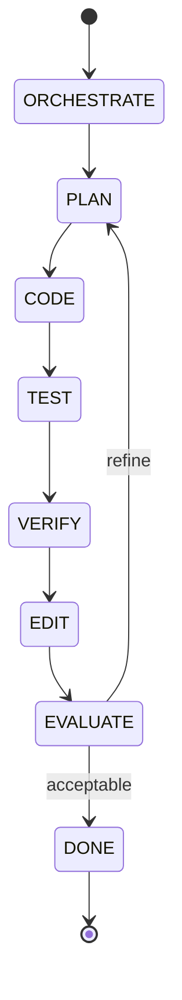
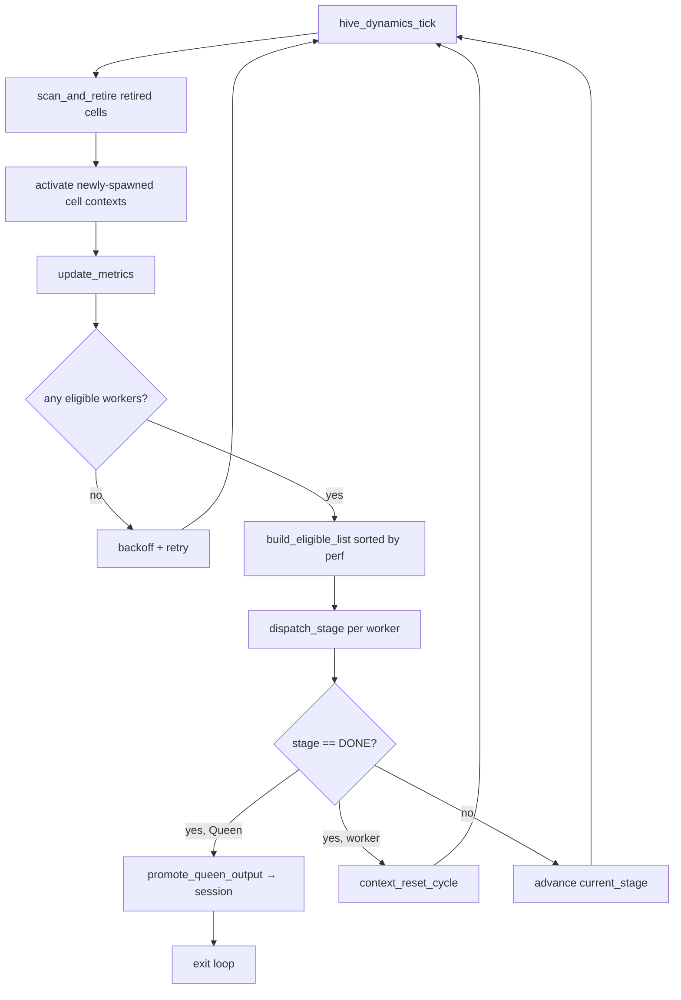

# Overall Flow (Runtime & State Machine)

Short summary
--

This document sketches the high-level runtime flow that wires together initialization, the hierarchical agent loop, the inference adapter, and the hive dynamics simulation. Primary code paths: [src/core/runtime.c](src/core/runtime.c) and [src/core/state_machine.c](src/core/state_machine.c).

Startup sequence
--

1. `hive_runtime_init()` initializes logging, selects and initializes an inference backend (`hive_inference_adapter_init_named()`), loads project rules, initializes the `hive_session`, the `hive_tool_registry`, and the `hive_state_machine`.
2. `hive_runtime_run()` calls `hive_state_machine_run()` to execute the hierarchical loop.

State machine loop (primary control flow)
--

The state machine advances through these named stages in order; each handler runs one agent stage and advances the state on success:

- `ORCHESTRATE` → `PLAN` → `CODE` → `TEST` → `VERIFY` → `EDIT` → `EVALUATE` → (`DONE` or back to `PLAN` for another iteration).

Mermaid state sketch


Where inference and tools are used
--

- Each stage invokes the agent pipeline (see `hive_agent_generate()` in [src/core/agent/agent.c](src/core/agent/agent.c)), which calls the inference adapter and reflexion layer. Stages may also execute tools via the tool registry (mediated by `hive_agent_execute_tool()`).

Dynamics (colony simulation)
--

- The dynamics simulation (`hive_dynamics_tick()` in [src/core/dynamics/dynamics.c](src/core/dynamics/dynamics.c)) is conceptually separate from the state machine loop. It models a colony of worker cells, the Queen, lifecycle transitions and spawning. The simulation is intended for the TUI / runtime observability and for experiments that involve population-level behaviours.

Entry points & key files
--

- `src/main.c` — program entry (wires CLI/GTK/TUI options).
- `src/core/runtime.c` — runtime initialization (`hive_runtime_init`) and run loop.

---

## Option 3 — Worker-Cell Mapping Scheduler

The legacy state machine is replaced (at compile time, see below) by a per-worker
pipeline scheduler that drives each colony cell through its own independent
ORCHESTRATE → PLAN → CODE → TEST → VERIFY → EDIT → EVALUATE cycle.

### Compile-time flags (`src/core/scheduler/hive_config.h`)

| Flag | Default | Meaning |
|---|---|---|
| `HIVE_LEGACY_SCHEDULER` | `0` | `1` = use old `hive_state_machine_run` |
| `HIVE_SINGLE_THREADED` | `0` | `1` = compile out `pthread_rwlock_t` |
| `HIVE_SCHEDULER_MAX_CONCURRENT_WORKERS` | `8` | Max cells dispatched per tick |
| `HIVE_SCHEDULER_BACKOFF_MS_SUPPRESSED` | `100` | Sleep (ms) when colony is fully suppressed |
| `HIVE_SCHEDULER_MIN_PERF_SCORE` | `10` | Minimum `perf_score` to be dispatched |

### Startup sequence (Option 3)

```
hive_runtime_init()
  └─ hive_dynamics_init()       spawn Queen cell at slot 0
  └─ hive_scheduler_init()      bind agent descriptors to all active cells
hive_runtime_run()
  └─ hive_scheduler_run()       drive the colony tick-by-tick until Queen completes
```

### Scheduler loop (per tick)



### Worker-cell binding invariant

- `hive_queen_spawn()` is the only path that creates `hive_agent_cell_t` entries.
- Immediately after creating a cell it calls `hive_agent_clone_descriptor(hive_agent_descriptor_for_role(role))`
  and stores the result in `cell->bound_agent` with `binding_generation = 1`.
- On re-queening `hive_queen_requeue_if_needed()` frees the old `bound_agent`,
  re-binds the Orchestrator descriptor, and increments `binding_generation`.
- `hive_scheduler_deinit()` (or `retire_cell()`) frees `bound_agent` and NULLs
  the pointer; `hive_dynamics_deinit()` skips already-NULL slots.

### Queen output promotion

Only the Queen cell's completed cycle writes back to `runtime->session`.
All other workers operate on their private `hive_agent_context_t` without
mutating shared state, which keeps the scheduler single-threaded-safe by
design.

### Integration test

`src/tests/scheduler_integration_test.c` (10 tests, guarded by `#ifdef HIVE_BUILD_TESTS`).
Build and run:
```
cc -DHIVE_BUILD_TESTS -Isrc $(pkg-config --cflags gtk4) \
   $(find src -name '*.c' | sort) \
   -o build/hive_scheduler_test \
   -pthread -lm -lncursesw $(pkg-config --libs gtk4)
./build/hive_scheduler_test
```
- `src/core/state_machine.c` — the hierarchical agent loop (handlers for each stage).
- `src/core/agent/*` — agent implementations and the generation pipeline.
- `src/core/inference/*` — inference adapter registry and mock backend.
- `src/core/dynamics/*` & `src/core/queen/*` — colony simulation.
- `src/tools/registry.c` — tool execution and approval gate.

Open questions / integration notes
--

- The coupling between the agent state machine and the colony dynamics is intentionally loose; document expected interactions (if any) between session outputs and `d->demand_buffer_depth` or other simulation inputs.
- Document how the TUI (`src/gtk/*`) and optional API server surface runtime state and accept control commands (e.g., advancing ticks, toggling auto-approve).
